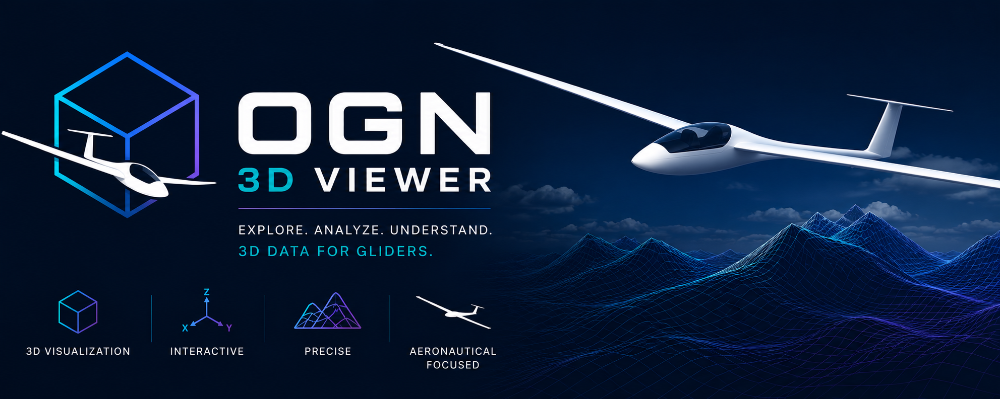
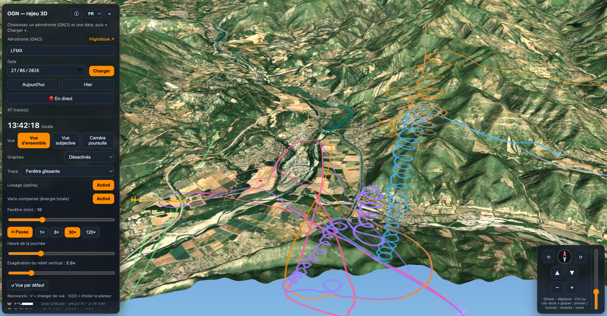
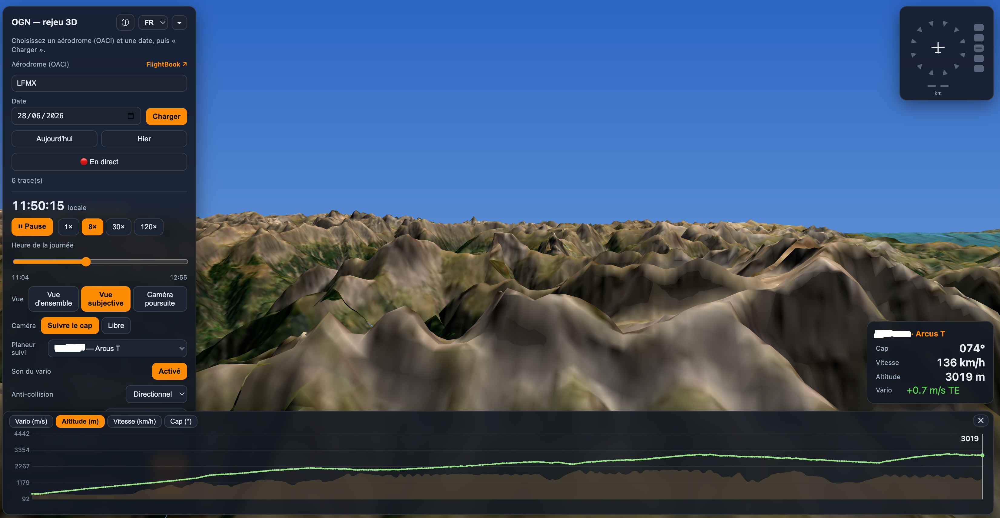
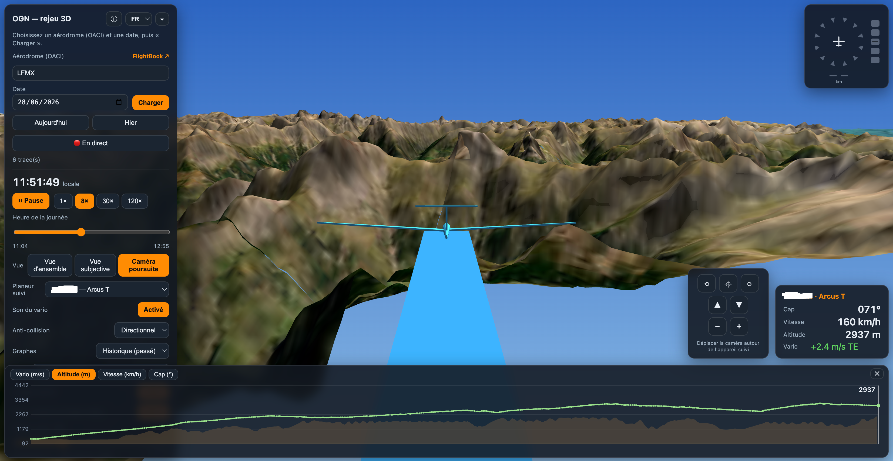
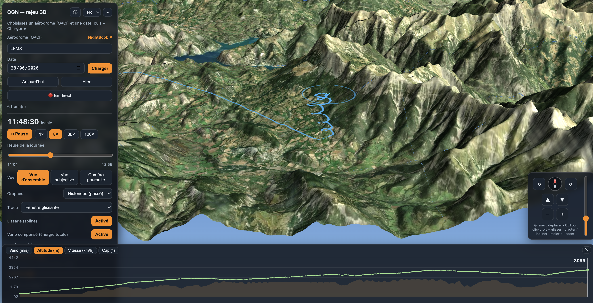

<p align="center"></p>

# OGN 3D Viewer

*Read this in [French / Français](README.fr.md).*

**3D replay of glider flights from the [Open Glider Network](http://wiki.glidernet.org/) (OGN), in your browser.**

👉 **Live demo: https://s-celles.github.io/ogn-3d-viewer/**

Pick an airfield (ICAO code) and a date, and the viewer reconstructs the day's
glider tracks over 3D terrain — with playback, a cockpit (first-person) view,
and a head-up display showing heading, altitude and vario.

**Deep linking:** the airfield and date can be passed as URL parameters, e.g.
`…/ogn-3d-viewer/?icao=LFBI&date=2024-06-01`, so you can link straight to a day
(for instance from the [OGN FlightBook](https://flightbook.glidernet.org/)). The
URL stays in sync as you load airfields, and the info panel links back to the
matching FlightBook page.

  

## Screenshots

<table>
  <tr>
    <td width="50%"><br><sub><b>Overview</b> — a day's tracks over 3D terrain.</sub></td>
    <td width="50%"><br><sub><b>Cockpit</b> (first-person) view with the head-up display.</sub></td>
  </tr>
  <tr>
    <td width="50%"><br><sub><b>Chase camera</b> with the glider model and anti-collision indicator.</sub></td>
    <td width="50%"><br><sub><b>Graphs</b> drawer — altitude, speed and heading.</sub></td>
  </tr>
</table>

## Features

- **Loading** — airfield search (ICAO or national/FAA code), real-time **live mode**, **IGC / GPX / KML** track, SeeYou **`.cup`** waypoint and XCSoar/LK8000 **`.plr`** polar import, **spot discovery** of famous gliding sites worldwide by continent (records, championships) — the list is a [Tabular Data Package](data/spots/spots.csv) kept current by `just check-spots` — and **live hot spots** ranking where gliders are airborne right now. The app opens on this Discover page (the landing screen); clicking a hot spot loads the day of the nearest real airfield — even areas named after an OGN receiver are resolved to a FlightBook airfield.
- **3D scene** — terrain with satellite imagery (adjustable resolution) and a selectable base map, an *experimental* finer **IGN RGE ALTI / BD ORTHO** detail over France, three views (overview, cockpit, chase), HUD, final-glide cone, ground shadows, altitude curtain, per-aircraft labels, **points of interest** — named OSM summits and imported `.cup` waypoints with per-type icons (airfield, outlanding, summit, obstacle, landmark) — a **2D minimap** inset, an opt-in **overview HUD** for the focused aircraft, and an **active-aircraft-only** filter.
- **Playback** — time-of-day scrubber, forward/reverse play, 0.25× / 1× / 4× / 8× / 30× presets plus a custom-speed field, track modes, trail effects (neon / contrail / bloom), spline smoothing, graphs.
- **Instruments & traffic** — estimated attitude, total-energy vario, opt-in **netto / super netto** (from an importable glider polar), vario audio, track-up radar or directional anti-collision.
- **App** — **5-language** UI (en / fr / de / es / it), shareable links (site, date, view, aircraft, speed, moment) with a **QR code**, selectable **base map** (Esri / OpenTopoMap / OpenStreetMap), **persisted settings** (localStorage + reset), **offline PWA** with an adjustable tile cache, keyboard shortcuts, and a **developer mode** (`?dev=1`: wireframe, FPS, cache counters…).

📖 **Full feature guide:** the **📖 Guide** button in the **ⓘ** panel, or [`docs/features.en.md`](docs/features.en.md).

## How it works

A **client-side single-page app** written in **TypeScript** and bundled with
**[Bun](https://bun.sh/)** — no backend. The source lives in [`src/`](src/) as
small ES modules ([`igc.ts`](src/igc.ts) parsing, [`flight-math.ts`](src/flight-math.ts)
geometry, [`terrain.ts`](src/terrain.ts), [`render.ts`](src/render.ts),
[`ui.ts`](src/ui.ts), a shared [`state.ts`](src/state.ts), etc.). It uses:

- [deck.gl](https://deck.gl/) (the scoped `@deck.gl/*` npm packages, tree-shaken)
  for the 3D terrain and track rendering;
- the public [OGN FlightBook API](https://flightbook.glidernet.org/) for the
  logbook and IGC tracks (called directly from the browser — the API exposes
  open CORS);
- AWS Terrarium elevation tiles and Esri World Imagery for the terrain;
- the public [Overpass API](https://overpass-api.de/) for named OpenStreetMap
  summits, plus optional user-imported SeeYou `.cup` waypoints, as points of interest.

The [build script](scripts/build.ts) also emits a web-app manifest, icons and a
service worker ([`sw.js`](scripts/build.ts)): the app shell is served
network-first (a new deploy updates as soon as you're online, and works offline
otherwise), while map tiles are cached persistently (cache-first) so revisits
don't re-download them. Preferences live in `localStorage` (see
[`settings.ts`](src/settings.ts)).

## Tech stack

- **TypeScript** (strict) — domain types for tracks, the FlightBook API and the
  shared app state.
- **Bun** — bundler, dev server and test runner, no separate toolchain.
- **deck.gl 9** via tree-shaken scoped packages, plus `upng-js` for pure-JS
  terrain-tile decoding.

## Development

Requires [Bun](https://bun.sh/). Install dependencies once, then:

```bash
git clone https://github.com/s-celles/ogn-3d-viewer.git
cd ogn-3d-viewer
bun install

bun run serve      # build once + serve dist/ on http://localhost:3000
bun run dev        # rebuild dist/ on every change (watch; pair with a static server)
bun run build      # production build (minified) → dist/
bun test           # unit tests for the pure modules (igc, flight-math)
bun run typecheck  # tsc --noEmit
```

`bun run serve` is the quick way to look at the app. For a live edit loop, run
`bun run dev` (rebuilds `dist/` on save) in one terminal and serve `dist/` in
another (e.g. `python3 -m http.server -d dist 3000`).

> Note: we bundle with [`bun build`](https://bun.sh/docs/bundler) rather than
> Bun's built-in HTML dev server (`bun ./index.html`) — the latter's on-the-fly
> module splitting mis-resolves the deck.gl/luma graph and breaks the terrain
> mesh. deck.gl and luma.gl are pinned to 9.1.0 (see the `overrides` in
> [`package.json`](package.json)) because luma 9.3 changed the mesh API our
> hand-built terrain relies on.

## Data limitations

OGN data is community-sourced and comes with caveats — these are also shown in
the app via the ⓘ button:

- Tracks depend on ground-station reception: gaps, dropouts or truncated climbs are possible.
- Only aircraft **registered and "tracked"** in the OGN database appear; anonymous or non-equipped aircraft are missing.
- Positions are interpolated between received beacons — not exactly the path actually flown.
- GNSS altitude is shown over MSL terrain: slight floating near the ground is possible (geoid offset of tens of metres).
- No attitude data is transmitted: the displayed bank/pitch (and the banking horizon) are **estimated** from ground track and speed, not measured.
- **OGN keeps IGC tracks for only ~24 hours**, so older dates often have no replayable data.

Please review and respect the official
[OGN data usage policy](https://www.glidernet.org/ogn-data-usage/).

## Deployment

The site is published to **GitHub Pages** automatically by the
[`.github/workflows/deploy.yml`](.github/workflows/deploy.yml) GitHub Actions
workflow on every push to `main`: it sets up Bun, type-checks, runs the tests,
builds to `dist/`, and publishes that folder. Asset URLs are emitted relative
(`--public-path=./`) so the build works under the project's `/ogn-3d-viewer/`
sub-path.

To enable it on a fork: go to **Settings → Pages → Build and deployment → Source**
and select **GitHub Actions**.

## AI assistance disclosure

This project was developed with the assistance of AI tools. AI was used to help
write and refine the application code, the deployment workflow and this
documentation. All output was reviewed by a human maintainer before publication.

## License

Licensed under the **GNU Affero General Public License v3.0 (AGPL-3.0)** — see
[`LICENSE`](LICENSE). In short: you may use, modify and redistribute this code,
but if you run a modified version as a network service you must make your
modified source available to its users.

OGN data belongs to the [Open Glider Network](http://wiki.glidernet.org/) and
its contributors.
